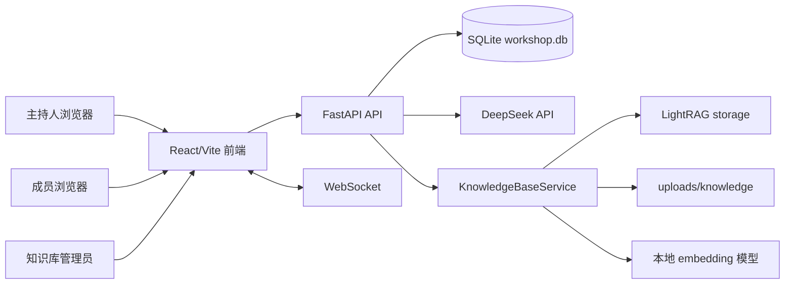
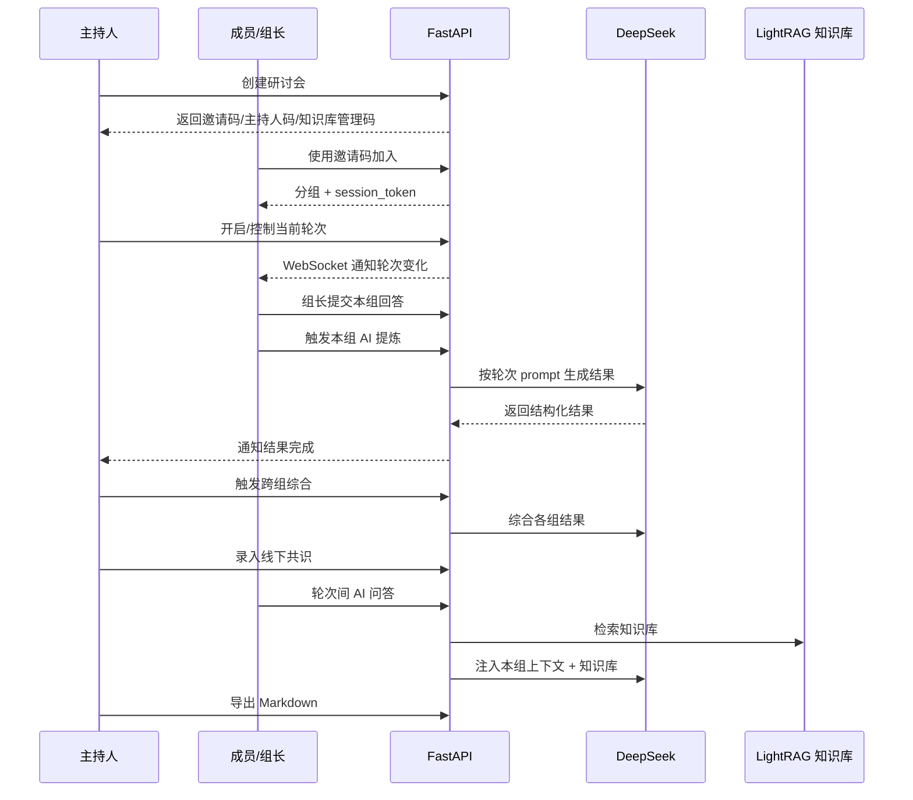

# 领导力共创研讨会 AI 智能体项目交接文档

更新时间：2026-06-14

## 1. 项目概况

本项目是一个用于支撑“领导力共创研讨会”的独立 Web 系统，核心场景是约 20 人、多个小组在主持人控场下完成四轮领导力模型共创。系统负责成员入场分组、四轮讨论控流、组长统一填写、AI 提炼、跨组综合、知识库问答和最终 Markdown 导出。

一句话定位：把线下研讨会中分散的讨论、人工汇总和会后整理，转成可追踪、可导出、可复用的数字化流程。

核心价值：

- 主持人可创建研讨会，发放成员邀请码、主持人码、知识库管理码。
- 成员用邀请码加入后自动分组，每组首位成员默认为组长。
- 组长代表小组提交回答、触发本组 AI 提炼、编辑 AI 结果。
- 主持人查看全组数据，触发跨组综合，录入线下共识，导出完整记录。
- 知识库支持上传 Office、Markdown、TXT 文件，用 LightRAG 检索增强 AI 问答。

## 2. 当前交付物地图

项目根目录主要内容：

```text
leader/
├── demo3/                         # 主应用，前后端代码都在这里
├── docs/                          # PRD、开发计划、操作手册、本文档
├── product-requirements/          # PRD 生成技能产物
├── 领导力模型知识库/              # 业务知识库资料目录
├── 领导力共创研讨会AI智能体.docx  # 原始需求来源之一
└── .tmp/                          # 临时快照/中间文件，不应直接当主线代码
```

`demo3/` 是实际工程：

```text
demo3/
├── start.bat
├── backend/
│   ├── main.py                    # FastAPI 入口
│   ├── config.py                  # 环境配置
│   ├── database.py                # SQLAlchemy async SQLite
│   ├── models.py                  # 数据模型
│   ├── schemas.py                 # Pydantic schema
│   ├── seed.py                    # 四轮问题种子数据
│   ├── routes/
│   │   ├── workshops.py           # 研讨会、主持人控流、导出
│   │   ├── rounds.py              # 成员回答、组 AI、综合 AI
│   │   ├── knowledge.py           # 知识库管理
│   │   └── ai_qa.py               # 成员 AI 问答
│   ├── services/
│   │   ├── ai_service.py          # DeepSeek prompt、调用、输出校验
│   │   ├── knowledge_base_service.py
│   │   └── export_service.py
│   ├── tests/                     # 后端 pytest
│   ├── workshop.db                # 本地 SQLite 运行数据
│   ├── uploads/                   # 上传文件运行数据
│   └── lightrag_storage/          # LightRAG 运行缓存
└── frontend/
    ├── package.json
    ├── vite.config.ts
    └── src/
        ├── App.tsx                # 前端路由
        ├── pages/
        │   ├── HomePage.tsx
        │   ├── HostDashboard.tsx
        │   ├── WorkshopPage.tsx
        │   └── KnowledgeBasePage.tsx
        ├── hooks/
        ├── services/api.ts
        ├── components/
        └── types/index.ts
```

## 3. 技术栈

| 层级 | 技术 | 说明 |
| --- | --- | --- |
| 前端 | React 19, TypeScript, Vite, Tailwind CSS v4, Radix UI, lucide-react | SPA，桌面浏览器优先 |
| 后端 | FastAPI, SQLAlchemy async, Pydantic v2, Uvicorn | Python 单体 API |
| 数据库 | SQLite + aiosqlite | 当前适合本地/单机场景 |
| 实时同步 | FastAPI WebSocket | 按 workshop + channel 广播 |
| AI | DeepSeek OpenAI-compatible API | chat 用单组提炼和问答，reasoner 用跨组综合 |
| 知识库 | LightRAG + sentence-transformers 本地 embedding | 默认模型 `BAAI/bge-small-zh-v1.5` |
| 测试 | pytest, Vitest | 后端覆盖更完整，前端有 API/组件测试 |

## 4. 架构总览



后端是分层单体：

- `routes/`：处理 HTTP 请求、身份校验、流程状态变更。
- `services/`：封装 AI、知识库、导出等可复用业务能力。
- `models.py`：定义持久化对象和关系。
- `websocket_manager.py`：维护 workshop 下不同频道的连接并广播事件。

前端是页面 + hooks 结构：

- `HomePage`：成员入口、主持人入口、创建研讨会、恢复会话。
- `WorkshopPage`：成员端讨论页，含问题、回答、组 AI、AI 问答、小组成员。
- `HostDashboard`：主持人后台，含总览、轮次控流、各组结果、综合提炼、主持人输入、知识库、导出。
- `KnowledgeBasePage`：独立知识库管理页面。

## 5. 业务流程



四轮固定议程来自 `demo3/backend/seed.py`：

| 轮次 | 标题 | 主要产出 |
| --- | --- | --- |
| 1 | 关键领导力维度 | 每组 5-8 个维度 + 跨组维度综合 |
| 2 | 领导力维度分层 | 维度 × 高层/中层/基层差异表 |
| 3 | 领导力行为描述 | 各层级可观察行为动作 |
| 4 | 领导力应用场景 | 模型落地应用建议 |

注意：README 中描述了默认讨论/填写时长，当前 `seed.py` 中四轮 `discussion_time` 和 `input_time` 都是 15 分钟；如果交付口径要求 15/30/30/20 分钟，需要同步 `seed.py` 与前端文案。

## 6. 运行手册

环境要求：

- Python 3.10+
- Node.js 18+
- 可访问 DeepSeek API
- 首次使用知识库上传时，需要下载或缓存 `BAAI/bge-small-zh-v1.5` embedding 模型

后端启动：

```powershell
cd demo3\backend
py -3.10 -m venv venv
venv\Scripts\Activate.ps1
pip install -r requirements.txt
python seed.py
python main.py
```

前端启动：

```powershell
cd demo3\frontend
npm install
npm run dev
```

默认访问：

- 前端：`http://localhost:5173`
- 后端 API：`http://localhost:8000/api`
- 健康检查：`http://localhost:8000/api/health`
- WebSocket：`ws://localhost:8000/ws/{workshop_id}?channel={host|group_id}`

也可以尝试运行 `demo3/start.bat` 一键启动，但接手人应先确认脚本里的路径与本机环境匹配。

## 7. 配置项

后端配置集中在 `demo3/backend/config.py`，通过 `.env` 覆盖。

建议在 `demo3/backend/.env` 写入：

```env
DATABASE_URL=sqlite+aiosqlite:///./workshop.db
DEEPSEEK_API_KEY=sk-...
DEEPSEEK_BASE_URL=https://api.deepseek.com
DEEPSEEK_CHAT_MODEL=deepseek-chat
DEEPSEEK_REASONER_MODEL=deepseek-reasoner
CORS_ORIGINS=http://localhost:3000,http://localhost:5173
KB_UPLOAD_DIR=./uploads/knowledge
KB_LIGHTRAG_DIR=./lightrag_storage
LOCAL_EMBEDDING_MODEL=BAAI/bge-small-zh-v1.5
KB_CHUNK_SIZE=1000
KB_CHUNK_OVERLAP=200
```

前端配置由 `demo3/frontend/src/services/api.ts` 读取：

| 变量 | 默认值 | 用途 |
| --- | --- | --- |
| `VITE_API_BASE_URL` | `http://localhost:8000/api` | API 基地址 |
| `VITE_WS_BASE_URL` | 自动从 API 推导 | WebSocket 基地址 |

## 8. 数据模型与权限边界

核心表：

| 模型 | 作用 |
| --- | --- |
| `Workshop` | 研讨会主表，保存邀请码、主持人码、知识库管理码、当前轮次、状态 |
| `Participant` | 成员，保存组别、是否组长、`session_token` |
| `Round` | 四轮议程、状态、计时信息 |
| `Question` | 每轮问题 |
| `Answer` | 成员/组长提交的回答 |
| `GroupRoundResult` | 每组每轮 AI 提炼结果，含原始版、编辑版、状态、错误 |
| `SynthesisResult` | 跨组综合结果 |
| `HostInput` | 主持人录入的线下共识或补充信息 |
| `KnowledgeDocument` | 知识库文档元数据 |
| `AIQuestionLog` | 成员 AI 问答记录 |

权限边界：

- 主持人：使用 `host_code`，可查看全量数据、控制轮次、改组长、编辑结果、导出。
- 成员：使用 `participant_id + session_token`，只能访问自己所在小组的数据。
- 组长：成员身份上额外要求 `is_group_leader=True`，才能提交回答、触发 AI、编辑本组 AI 结果、转移组长。
- 知识库管理员：使用 `kb_admin_code`，可上传、查询、删除知识库文档。

重点文件：

- 成员身份校验：`demo3/backend/routes/rounds.py`
- 主持人码校验：`demo3/backend/routes/workshops.py`
- 知识库管理码校验：`demo3/backend/routes/knowledge.py`
- AI 问答组内隔离：`demo3/backend/routes/ai_qa.py`

## 9. AI 与知识库实现

AI 服务在 `demo3/backend/services/ai_service.py`：

- `GLOBAL_SYSTEM_PROMPT` 固化企业背景、文化锚点、管理层级和输出规范。
- 单组 AI 使用 `deepseek-chat`。
- 跨组综合使用 `deepseek-reasoner`。
- 每轮有独立 prompt 和校验器：
  - `validate_dimensions`
  - `validate_layer_table`
  - `validate_behaviors`
  - `validate_applications`
- `_generate_with_validation` 最多重试 3 次；仍失败时结果状态会进入 `validation_failed`。

知识库服务在 `demo3/backend/services/knowledge_base_service.py`：

- 支持扩展名：`doc`, `docx`, `xls`, `xlsx`, `ppt`, `pptx`, `md`, `txt`。
- 上传内容以文件落地到 `uploads/knowledge`。
- 文本解析后写入 LightRAG。
- embedding 使用本地 sentence-transformers 模型。
- LightRAG 工作目录当前固定为 `lightrag_storage/unified`。

重要交接点：虽然 `KnowledgeDocument` 有 `workshop_id` 字段，但当前知识库检索和列表基本走统一知识库目录，`list_docs` 查询也返回所有未删除文档。也就是说当前实现是“统一知识库”，不是严格按每场研讨会隔离知识库。如果未来要多场并行、不同资料隔离，需要改 `KnowledgeBaseService._get_rag_adapter`、`list_docs`、`search` 的作用域策略。

## 10. 实时同步

WebSocket 入口：`demo3/backend/main.py`

```text
/ws/{workshop_id}?channel={host|group_id}
```

广播管理：`demo3/backend/websocket_manager.py`

主要事件：

| 事件 | 触发场景 | 接收端 |
| --- | --- | --- |
| `round_changed` | 主持人切换轮次 | 全员 |
| `timer` | 主持人开始/暂停/恢复计时 | 全员 |
| `new_answer` | 成员提交回答 | 当前 workshop |
| `ai_result_status` | AI 提炼处理中/完成/失败 | 对应小组 + 主持人 |
| `result_ready` | 单组 AI 结果完成 | 对应小组 + 主持人 |
| `synthesis_ready` | 跨组综合完成 | 全员 |
| `group_leader_changed` | 组长变化 | 对应小组 + 主持人 |
| `workshop_completed` | 研讨会结束 | 全员 |

前端收到事件后通常会触发一次静默重新拉取，避免本地状态漂移。主持人端还有 30 秒轮询兜底。

## 11. 测试与验证

后端测试目录：`demo3/backend/tests/`

建议接手后先跑：

```powershell
cd demo3
backend\venv\Scripts\python.exe -m pytest backend\tests
```

前端验证：

```powershell
cd demo3\frontend
npm test
npm run build
```

重点测试文件：

- `test_workshops.py`：研讨会创建、加入、主持人视图等。
- `test_rounds.py`：回答、AI 触发、综合、组长转移等。
- `test_ai_qa_auth.py`：AI 问答身份隔离。
- `test_knowledge_base.py`：知识库上传、解析、删除。
- `test_websocket.py`：实时广播。
- `test_ai_service.py`：AI 输出校验逻辑。

本次交接文档生成未改业务代码，未运行全量测试；接手人正式变更前应先跑上述命令建立基线。

## 12. 部署与运维注意事项

当前实现更接近本地/单机部署原型，正式部署前建议确认：

- SQLite 是否满足并发和数据可靠性要求；生产建议迁移到 PostgreSQL 或 MySQL。
- `workshop.db`、`uploads/knowledge`、`lightrag_storage` 是否需要持久化挂载和备份。
- `DEEPSEEK_API_KEY`、embedding 模型缓存、网络访问是否在部署环境可用。
- CORS 是否只允许正式前端域名。
- WebSocket 反向代理是否正确透传升级头。
- AI 调用超时时间较长，代理、网关、前端超时要同步调整。
- 上传文件上限当前是 50MB，Office 解析逻辑为轻量 XML/文本解析，不适合复杂版式还原。
- 当前 prompt 中包含公司背景和文化表述，修改前需与业务方确认。

## 13. 常见问题排查

| 问题 | 可能原因 | 排查位置 |
| --- | --- | --- |
| 后端启动失败 | 缺依赖、Python 版本不对、端口 8000 被占用 | `requirements.txt`, `main.py` |
| AI 提炼失败 | `DEEPSEEK_API_KEY` 缺失、API 限流、输出格式校验失败 | `services/ai_service.py`, 后端日志 |
| 知识库上传卡住 | 首次下载 embedding 模型、LightRAG 初始化慢、tokenizer 资源缺失 | `services/knowledge_base_service.py` |
| 成员看不到数据 | `session_token` 失效或 sessionStorage 被清空 | `frontend/src/lib/memberSession.ts`, `routes/rounds.py` |
| 主持人码失效 | URL code 错误或本机缓存了旧主持人记录 | `HomePage.tsx`, `hostSession.ts` |
| WebSocket 不更新 | 代理未支持 WebSocket、channel 不对、连接断开 | `websocket_manager.py`, `useWebSocket` |
| 综合提炼不能触发 | 至少需要两个小组已有 ready/edited 结果 | `routes/rounds.py` |
| 知识库资料串场 | 当前是统一知识库，不是每场研讨会独立索引 | `KnowledgeBaseService` |

## 14. 当前工作区状态

截至本文档创建时，外层仓库不是干净状态：

- `demo3` 是子项目/子模块指针，外层 diff 显示从 `72ba597...` 更新到 `72b13fa...`。
- `docs/领导力研讨会操作手册.docx` 处于删除状态。
- `docs/领导力研讨会智能体-参会成员操作手册.docx` 和 `docs/领导力研讨会智能体-综合操作手册.docx` 是未跟踪文件。
- `.tmp/leader-ai-workshop-snapshot/` 是未跟踪快照。
- `demo3` 内部还有未跟踪的 `docs/ai-prompts-flow.md` 和 `新建文件夹/`。

接手人第一步应确认这些文件是否是正式交付物、临时产物还是误操作，再决定提交、恢复或清理。不要直接执行 reset 或清理命令。

## 15. 接手清单

建议接手顺序：

1. 阅读 `docs/leadership-workshop-ai-agent-prd.md`，确认业务目标和验收口径。
2. 阅读 `demo3/README.md`，掌握当前实现能力和启动步骤。
3. 进入 `demo3/backend`，配置 `.env`，启动 API，访问 `/api/health`。
4. 进入 `demo3/frontend`，启动 Vite，完整走一遍主持人创建、成员加入、提交回答、AI 提炼、综合、导出。
5. 上传一份小型 `txt` 或 `md` 知识库文件，确认 LightRAG、embedding、AI 问答链路可用。
6. 跑后端 pytest 和前端 build，记录当前基线。
7. 梳理当前 git 状态，确认哪些 docx、快照和子模块变更需要纳入交付。
8. 与业务方确认四轮默认时长、知识库是否统一、导出格式是否只保留 Markdown。

## 16. 待确认风险与后续优化

优先级高：

- 明确生产数据存储方案，SQLite 只适合轻量单机。
- 明确知识库是否按研讨会隔离；当前是统一知识库。
- 明确四轮默认时长口径，README/PRD 与 `seed.py` 当前实现存在差异。
- 补齐 `.env.example`，避免 README 中提到但仓库内缺失。
- 对上传目录、LightRAG 目录、SQLite 数据库建立备份和迁移方案。

优先级中：

- AI 输出校验目前是字符串 token 校验，可升级为结构化 schema 校验。
- AI 生成状态依赖内存锁，多进程部署时需要改成分布式锁或任务队列。
- 知识库上传任务状态保存在内存，服务重启后任务状态会丢失。
- Office 解析是轻量实现，复杂文档建议引入更可靠的解析库或异步处理队列。
- 前端会话依赖 `sessionStorage/localStorage`，换设备或清缓存后需要邀请码/主持人码恢复。

优先级低：

- 导出目前是 Markdown，可根据交付需求增加 Word/PDF 导出。
- 可加入在线投票、多人协同编辑、企业微信/钉钉集成。
- 可增加管理端查看历史研讨会列表和模板复用能力。

